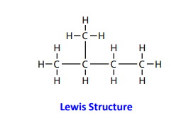
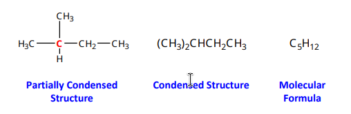
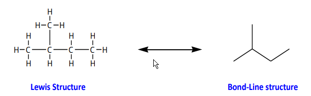
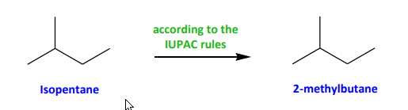
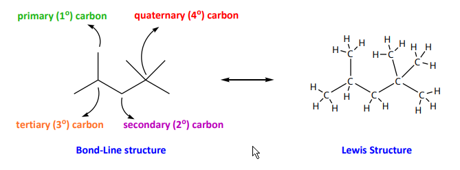

- **Organic chemistry**: Study of carbon-containing compounds and their properties
- Focus on **hydrocarbons**: Compounds composed of Carbon (C) and Hydrogen (H)
## Types of Hydrocarbons

### **Alkanes** (Saturated hydrocarbons)

- Contain only **single** ($\sigma$) bonds
- Example: $\ce{C_{2}H_{6}}$

### **Alkenes** (Unsaturated hydrocarbons)

- Contain at least one **carbon-carbon double bond** ($\sigma$ & $\pi$)
- Example: **$C₂H₄/$**

### **Alkynes** (Unsaturated hydrocarbons)

- Contain at least one **carbon-carbon triple bond** ($\sigma$ & $2\pi$)
- Example: **C₂H₂**
### **Aromatics**

- Contain a **benzene ring**
- Example: **C₆H₆**
---

## Molecular Representations

### **Isopentane (Example of an Alkane)**

- Carbon atoms in **alkanes** adopt a **tetrahedral geometry** (~109° bond angles)
- Carbon atoms are **sp³ hybridized**

### **Other Representations**

### **Bond-Line Structures (Line-Angle Formulas)**

More efficient way to represent organic molecules
**Rules**:
    
- Drawn in a **zigzag format**

- **Each bend and end represents a carbon**
        
- Hydrogen atoms are **not shown** explicitly
        
- Double and triple bonds are represented by **two and three lines**, respectively
        
- Heteroatoms (e.g., O, N, Cl, etc.) and their hydrogens **must be drawn**

---

## Nomenclature of Alkanes

- **Isopentane**: Common name for a five-carbon alkane
- **IUPAC Systematic Name**: **2-methylbutane**
- IUPAC rules provide a **systematic naming scheme** for organic compounds

---

## Classification of Carbon & Hydrogen Atoms
To complement the IUPAC (i.e., systematic) naming scheme, other descriptors are used to define the bonding environment about a given atom (usually C).
Consider the following alkane:

- **Primary (1°) carbon**: Bonded to **one** other carbon/heteroatom
- **Secondary (2°) carbon**: Bonded to **two** other carbon/heteroatoms
- **Tertiary (3°) carbon**: Bonded to **three** other carbon/heteroatoms
- **Quaternary (4°) carbon**: Bonded to **four** other carbon/heteroatoms
- The same classification applies to **hydrogen atoms**, based on the carbon they are attached to
