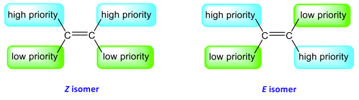
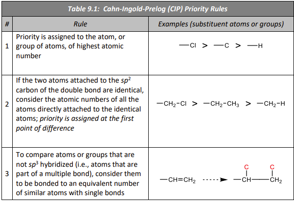

The E,Z system is used to assign the configuration of a highly-substituted alkene as follows: 

1. The relative priorities of the two groups attached to each of the sp2 carbons of the double bond are assigned as per the rules in [Table 9.1](#Table%209.1).
2. If the high priority groups are on the same side of the double bond, the isomer is allocated the **Z** configuration, and if they are on opposite sides of the double bond, the configuration is designated as **E**.

###### Table 9.1
