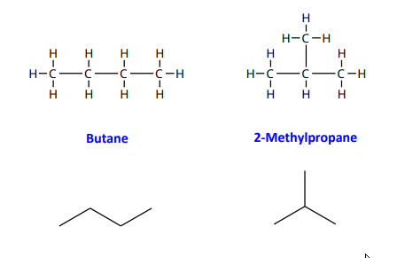
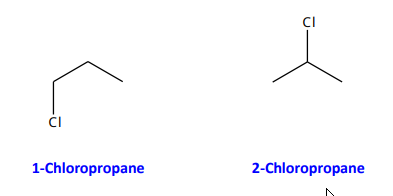

- Compounds with the same molecular formula but different atomic arrangements.
- **Constitutional isomers** differ in the order in which atoms are connected.
## Constitutional Isomers: Alkyl Substituents

>
>
>Example: Constitutional Isomers of C₄H₁₀
- **Butane**: Continuous 4-carbon chain
- **2-Methylpropane**: 3-carbon chain with 1 substituent

These structural differences define distinct compounds with different physical and chemical properties (e.g., boiling points differ by ~11°C).

> The branched nature of 2-Methylpropane reduces potential contact between molecules causing reduced intermolecular dispersion forces

---

## Constitutional Isomers: Non-Alkyl Substituents

- Substituting a heteroatom for a hydrogen atom in an alkane creates various constitutional isomers.
- **Haloalkanes (Alkyl Halides):** Replacing an alkane hydrogen with a halogen results in a class of compounds called haloalkanes or alkyl halides.

>
>Example: Constitutional Isomers of C₃H₇Cl
- **1-Chloropropane**
- **2-Chloropropane**

## Functional Groups

- The carbon-halogen bond in haloalkanes is considered a **functional group**.
- Functional groups exhibit predictable chemical behavior and are the reactive centers of parent carbon chains.

---
## Table 7.4: Common Halogen Substituents

| Condensed Structure | Name   |
| ------------------- | ------ |
| −F                  | fluoro |
| −Cl                 | chloro |
| −Br                 | bromo  |
| −I                  | iodo   |

## Drawing constitutional isomers
1. Determine all parent geometries
2. determine all hydrogen environments
3. determine all isomers