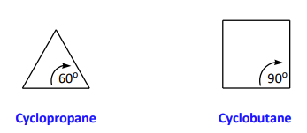

A cycloalkane is an alkane whose carbon atoms are arranged cyclically (i.e. in a ring).
- effectively non-polar compounds
- general formula of $C_nH_{2n}$ where $n \geq 3$

Angle strain is significant in both compounds

A sterically demanding eclipsed conformation is dominant for both compounds. The resulting ring strain is pronounced; both compounds are highly unstable.

The angle strain in both of these geometries 

Both compounds can alleviate their **torsional strain** by rotating about their C-C bonds; a *puckered* conformation. As a result, the ring strain is effectively eliminated, and both are stable species.
## Conformational Isomers
To alleviate ring strain (i.e. angular repulsion and torsional strain), cyclohexane adopts an energetically stable chair conformation by rotating about its C-C bonds.

> All bond angles are 109.5 and all H atoms on adjacent carbons are staggered

To draw chair conformers efficiently and accurately, follow the rules in Tables 8.2 and 8.3

