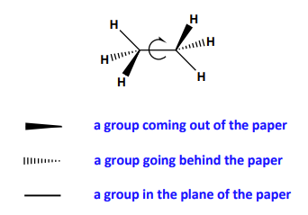
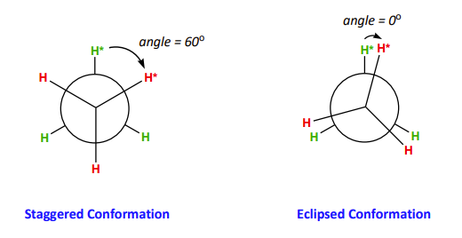

- Stereoisomers resulting from a rotation about a single ($\sigma$) bond (usually $C-C$)

### Depicting the 3D structure of an organic molecule

> wedge and dash depiction of ethane.

However, to effectively illustrate the conformational isomers of ethane it is best to view the molecule along the C-C bond, front to back

Consider the Newman projections for the two conformers of ethane:

angle between two h-c-c-h planes is a dihedral angle: in staggered it is 60 and in eclipsed it is 0

- The staggered conformations represents the lowest energy conformer and is stable (angle = 60)
	- This is because the stearic and electronic effects are minimized 
>stearic = the conflict between portions of a molecule competing to occupy the same spatial region (spatial contacts between bonds and atoms)

- the eclipsed conformation represents the highest energy conformer and is unstable (angle = 0)

In general, the energetic differences between conformational isomers can be illustrated best with a **potential energy diagram**, where y = potential energy and x = $\theta$. 

