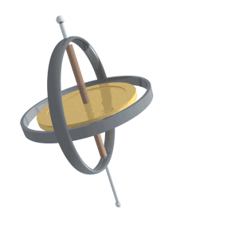

A spinning object will tend to precess as it slows down.

$$dL = L\sin \theta \phi$$
$$\frac{dL}{dt} = L \sin \theta \frac{d\phi}{dt}; \quad \frac{dL}{dt} = \tau = mgr\sin \theta; \quad L = I\omega; \quad \therefore \frac{d\phi}{dt} = \Omega$$
$$\Omega = \frac{d\phi}{dt}$$or

$$\Omega = \frac{Mgd}{I\omega}$$