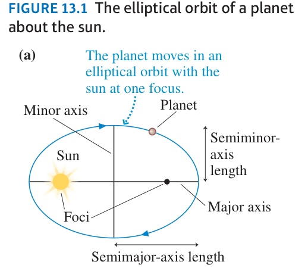

## Kepler's First Law

The planets travel in elliptical orbits with the Sun at one focus of the ellipse

> Note: a circle is just an ellipse where foci coincide.

## Kepler's Second Law

A line drawn from the Sun to a planet sweeps out equal areas during equal intervals of time

$$dA = \frac{1}{2}r^2 d\theta; \quad\therefore  d\theta = \frac{2}{r^2}dA;\quad L = mr^2 \frac{d\theta}{dt}; \quad \therefore L = 2m \frac{dA}{dt}$$
$$L = 2m \frac{dA}{dt}$$

## Kepler's Third Law

The square of a planet's orbital period is proportional to the cube of the semimajor-axis length (average distance)

$$P^2 = a^3$$

$$\therefore$$

$$T^2 = \frac{4\pi^2}{GM_{sun}}r^3$$
Derivation:

$$V^2 = \frac{GM_{sun}}{r} \to v = \frac{2\pi r}{T} \to (\frac{2\pi r}{T})^2 = \frac{GM_{sun}}{r} \to \frac{4\pi^2r^2}{T^2} = \frac{GM_{sun}}{r} \to T^2 = \frac{4\pi^2r^3}{GM_{sun}}$$
