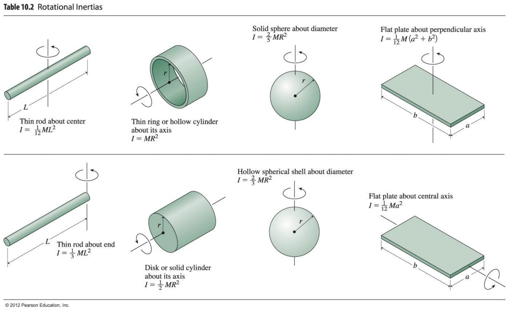

The moment of inertia (or rotational inertia) of a rigid body, $I$, measures the body's resistance to changes in its state of rotational motion. It is the rotational analogue of mass.

For a single particle rotating about an axis with distance $r$,

$$I = mr^2$$

For a system of discrete masses, the rotational inertia is the sum of the rotational *inertiae* of the individual passes.:

$$I = \Sigma mr^2 = m_{1}r_{1}^2 +  m_{2}r_{2}^2 +  \dots + m_{n}r_{n}^2 $$

Unlike mass, rotational inertia is dependent on the shape of the object, specifically the distribtuion of mass at the edges of the object. 

$$ [I] = [m][r^2] = kgm^2 $$

>
> Rotational inertiae of common geometries