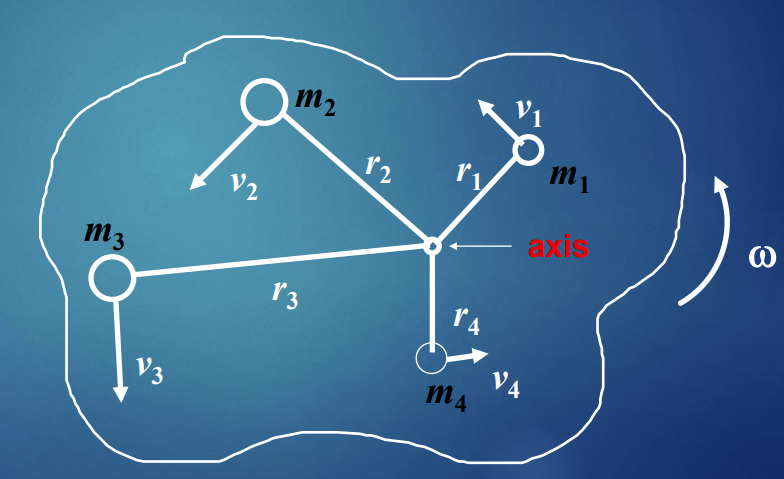
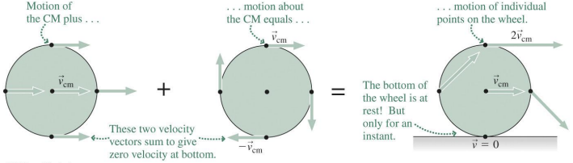

Consider a rotating rigid object, thinking about it as many smaller component parts. Let us calculate the kinetic energy of this rotating object.

The kinetic energy is the sum of the contribution from each indiivdual mass.

$$K = \Sigma \frac{1}{2}m_{i}v_{i}^2$$
As the object rotates, the velocities are tangential to the rotation; $v_{i} = \omega r_{i}$

$$K = \Sigma \frac{1}{2}m_{i}r_{i}^2w^2 = \frac{1}{2}(\Sigma m_{i}r_{i}^2)w^2\therefore K = \frac{1}{2}Iw^2$$

$$[K] = [I][w]^2 = \frac{kgm^2}{s^2} = J$$
In problems involving the conservation of energy and rotating objects, both rotational and linear $K$ must be considered. The sum of kinetic energy will have contributions from both the linear $K$ and the rotational $K$.

## Rolling Motion

Rolling motion combines linear motion and rotational motion. The rolling object's center of mass undergoes *translational*  (linear) motion as the object itself rotates about the center of mass.

Often in rolling motion the object moves without slipping and its point of contact with the supporting surface is instantaneously at rest. Then the rotational speed $\omega$ and linear speed$v$ are related by $v = \omega R$, where $R$ is the object's radius. 

The motion of the center of mass is distinct from the motion of the object around the center of mass. The total motion of any point is $\therefore$ the sum of the motion of center of mass plus the motion around the center of mass.

When an object rolls **without slipping**, the angular and linear velocities must be connected such that the point at the bottom of the object is motionless; $v = \omega R$

