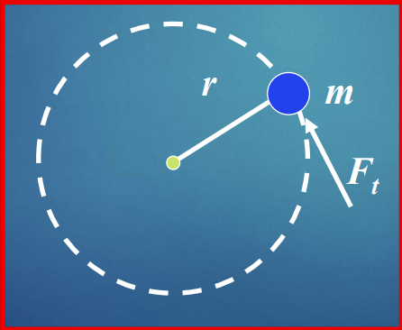
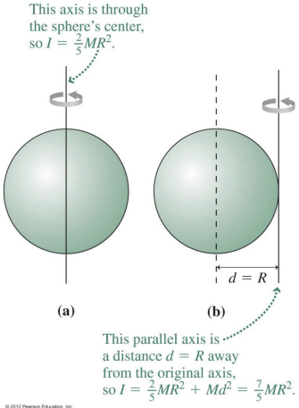

$F_t$ will cause a torque $\tau = F_{t}r = mr^2\alpha$.

The total torque about an axis for a rigid body composed of discrete masses:

$$\tau = \sigma \tau_{i} = \Sigma (mr^2)_{i}\alpha$$
thus $\tau = I\alpha$. This is the angular analogue of Newton's Second Law.

### Newton's Second Law for Rotation
For any object rotating about an axis, the sum of torques gives the moment of inertia times the angular acceleration.

$$\Sigma \vec{\tau} = I\vec{\alpha}$$
## Parallel Axis Theorem
If the rotational inertia $I_{cm}$ about an axis through the center of mass of a body is known, the **parallel axis theorem** allows the calculation of rotational inertia through any axis parallel thereto.

$$ $$
Where: 
- $I_{cm}$ is the rotational inertia about an an axis through the center of mass
- $d$ is the distance from the center of mass axis to the parallel axis
- $M$ is the total mass of the object

 