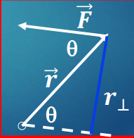
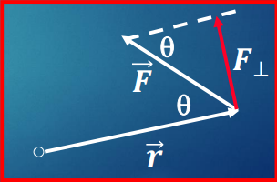

**Torque** is the tendency of a force to cause a rotation about an axis. Torque, $\vec{\tau}$, is a vector.

The torque caused by a force should be proportional to the magnitude of that force, and also proportional to the distance between where the force is applied and the axis of rotation.

$$ |\vec{\tau}| = |\vec{F}||\vec{r}|\sin \theta$$
$$\tau = Fr\sin \theta$$
$$[\tau] = [F][r] = Nm$$

The torque vector is perpendicular to both the force vector and the displacement vector from the rotation axis to the force application point. The torque will cause an angular acceleration in the same direction as the applied torque.

We can interpret $\tau = Fr\sin \theta$ in two ways:

#### Interpretation 1 - Moment Arm
$$\tau = Fr\sin \theta = F(r\sin \theta) = Fr_\perp$$
$r_\perp$ is the **moment arm** of the force: the perpendicular distance from the axis to the line of the force.

#### Interpretation 2

$$\tau = Fr\sin \theta = (F\sin \theta)r = F_{\perp}r$$
$F_{\perp}$ represents the component of the force which is perpendicular to the length $r$.

## Summing Torque

When a number of forces act on an object, the total torque on the object is the sum of the individual torques produced by the forces.

$$\vec{\tau}\_{total} = \Sigma \vec{\tau} = \vec{\tau_{1}} + \vec{\tau_{2}} + \vec{ \tau_{3}} + \dots$$