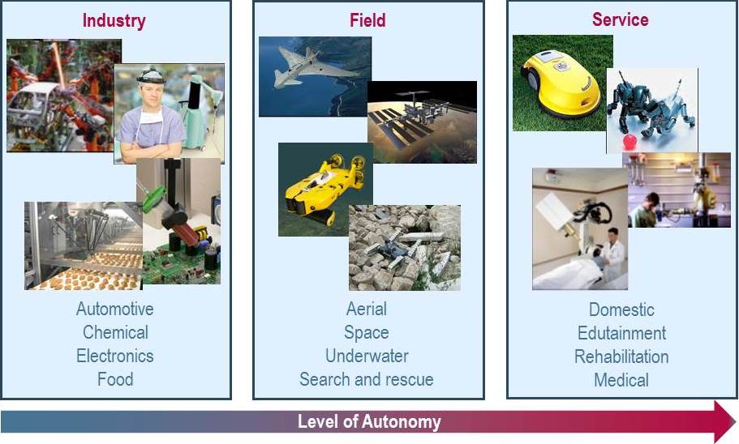

### What is a Robot?

- Robot (_robota_ = executive labour)
- One of human beings’ greatest ambitions has been to give life to their artifacts (_mythology_)
- People continue to imagine the robot as a humanoid who can speak, walk, see, and hear, with gestures and reactions of human type (_science fiction_)
- The robot is defined as a machine able to carry out tasks automatically to replace or improve human work (_reality_)

