### Components of a Robotic System

Mechanical system

- Locomotion apparatus (wheels, crawlers, mechanical legs)
- Manipulation apparatus (mechanical arms, end-effectors, artificial hands)

Actuation system

- Animates the mechanical components of the robot
- Motion control (servomotors, drives, transmissions

Sensory system

- Proprioceptive sensors (internal information on system)
- Exteroceptive sensors (external information on environment)

Control system

- Execution of action set by task planning coping with robot and environment’s constraints
- Adoption of feedback principle
- Use of system models

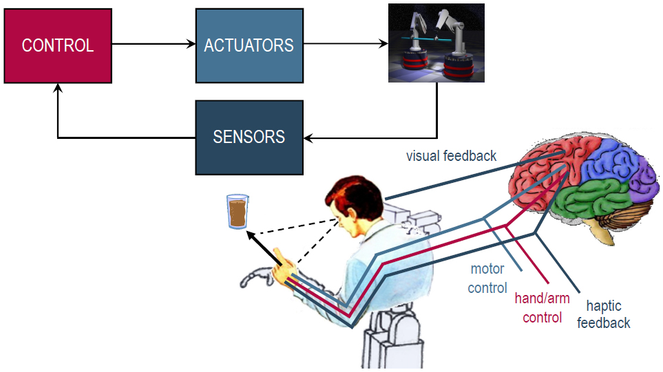
>Components of a robotic system

### Robot Mechanical Structure

Mechanical structure of _robot manipulator_: sequence of rigid bodies (_links_) interconnected by means of articulations (_joints_)

- _Arm_ ensuring mobility
- _Wrist_ conferring dexterity
- _End-effector_ performing the task required of robot

Mechanical structure

- _Open_ vs. _closed_ kinematic chain

Mobility

- _Prismatic_ vs. _revolute_ joints

Degrees of freedom

- 3 for _position_ + 3 for _orientation_

Workspace

- Portion of environment the manipulator’s end-effector can access

### Cartesian Manipulator

- Three prismatic joints
- Very good mechanical stiffness
- Wrist positioning accuracy constant everywhere in the workspace
- Low dexterity (all joints prismatic)
- Electric (seldom hydraulic) actuation
- Employed for transportation and assembly

Manipulation of objects of large dimensions and heavy weight  _gantry_ structure

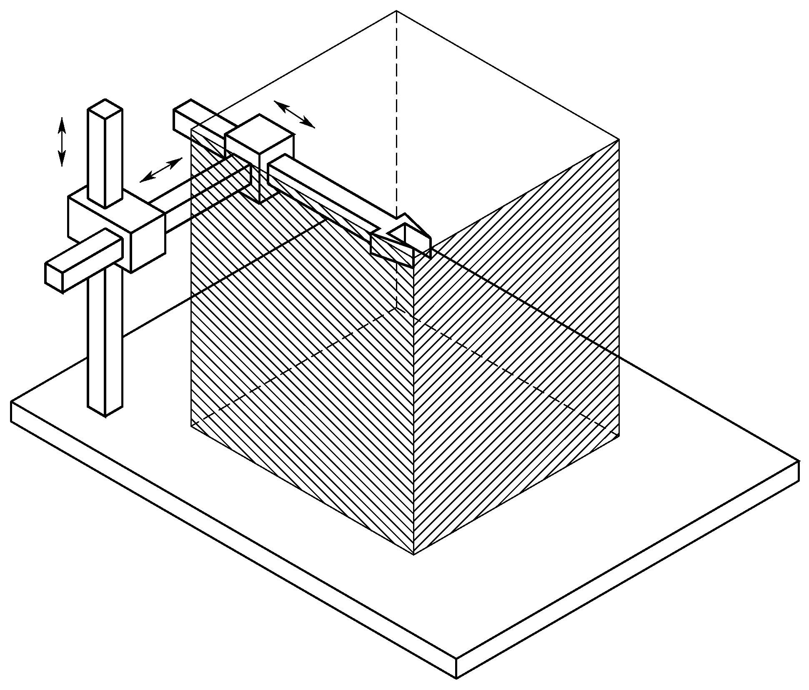
> Cartesian manipulator and its workspace

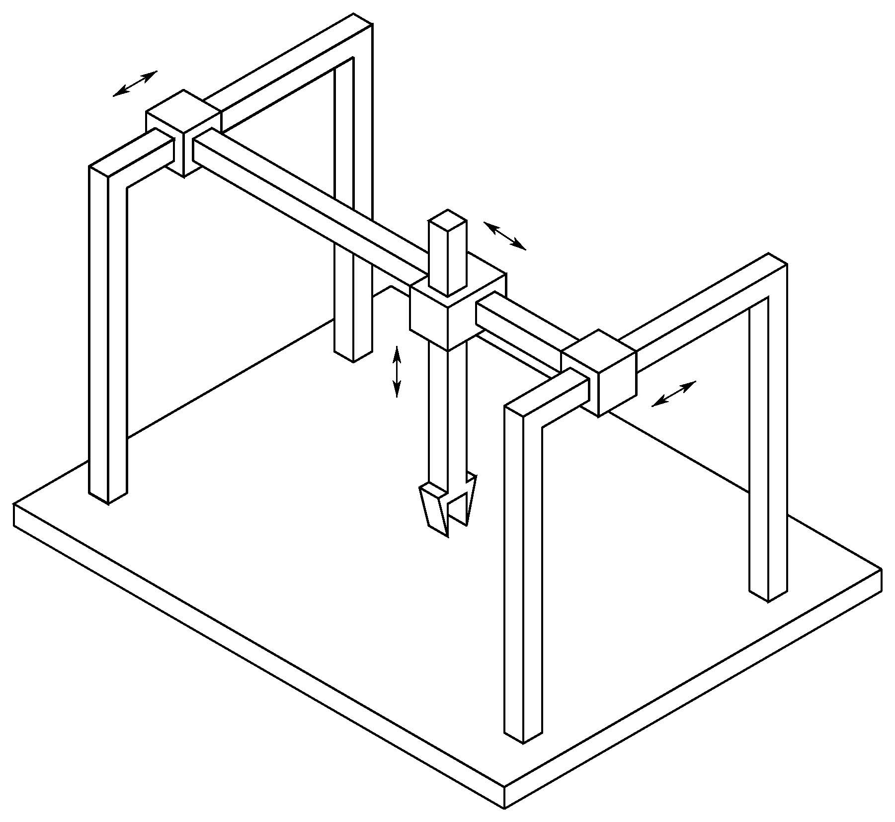
>Gantry manipulator

### Cylindrical Manipulator

- One revolute joint and two prismatic joints
- Good mechanical stiffness
- Wrist positioning accuracy decreases as horizontal stroke increases
- Horizontal prismatic joint makes wrist suitable to access horizontal cavities
- Employed for carrying objects even of large dimensions
- Hydraulic actuation preferred to electric actuation

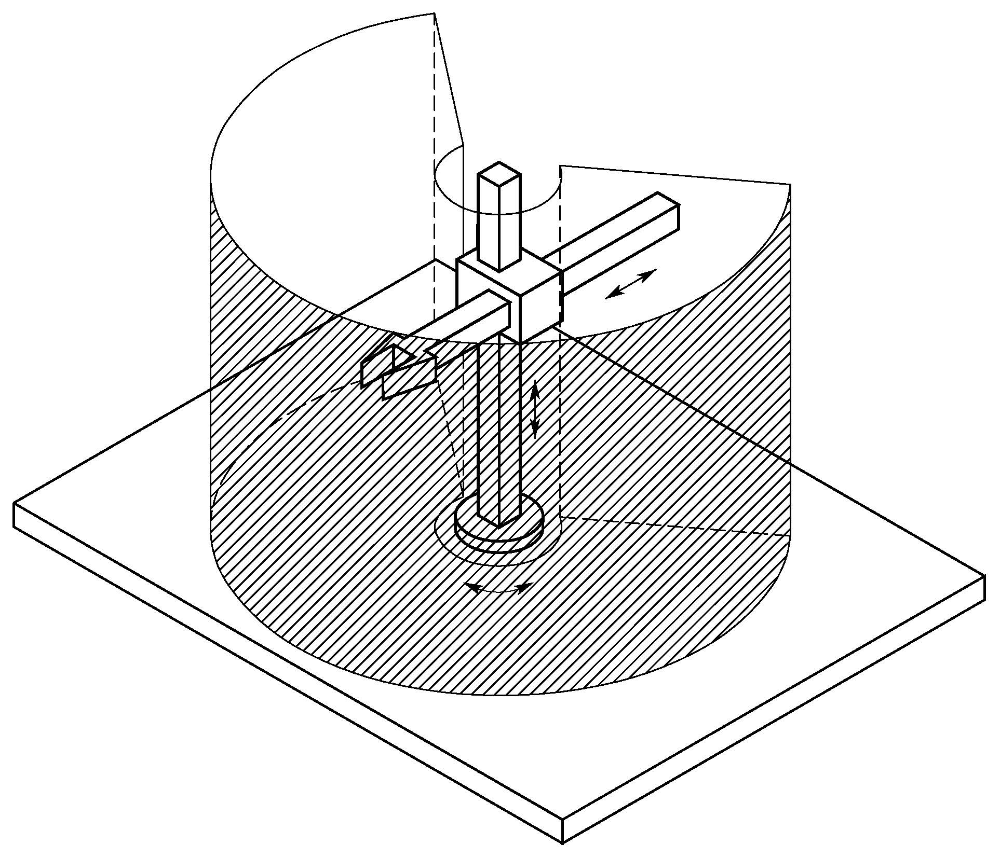
>
>Cylindrical manipulator and its workspace
### Spherical Manipulator

- Two revolute joints and one prismatic joint
- Fair mechanical stiffness
- Wrist positioning accuracy decreases as radial stroke increases
- Employed for machining
- Electric actuation
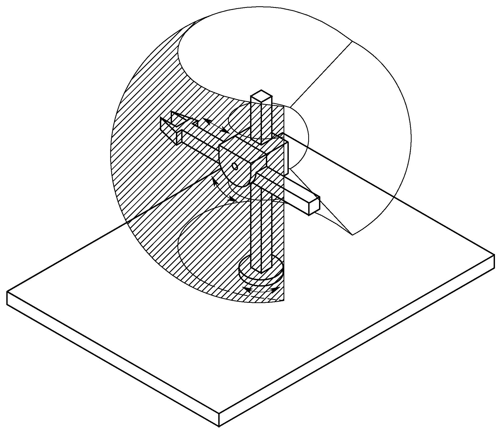
>Spherical manipulator and its workspace

### SCARA Manipulator

- Two revolute joints and one prismatic joint (all axes of motion are parallel)
- High stiffness to vertical loads and compliance to horizontal loads Selective Compliance Assembly Robot Arm
- Positioning accuracy decreases as distance of wrist from first joint axis increases
- Employed for manipulation of small objects (vertical assembly tasks)
- Electric actuation

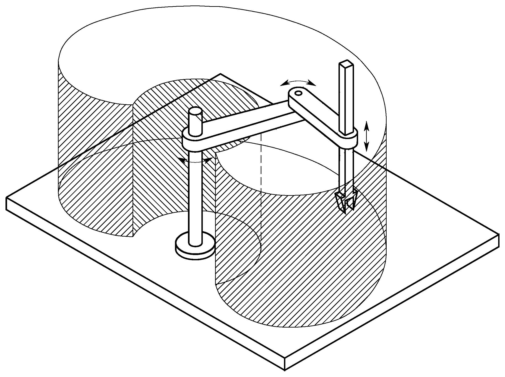
>SCARA manipulator and its workspace
### Anthropomorphic Manipulator

- Three revolute joints
- Most dexterous structure (similarity with human arm)
- Wrist positioning accuracy varies inside workspace
- Wide range of industrial applications
- Electric actuation

Manipulation of larger payloads _closed kinematic chain_ with higher stiffness to guarantee comparable positioning accuracy (_parallelogram geometry_ between shoulder and elbow joints)

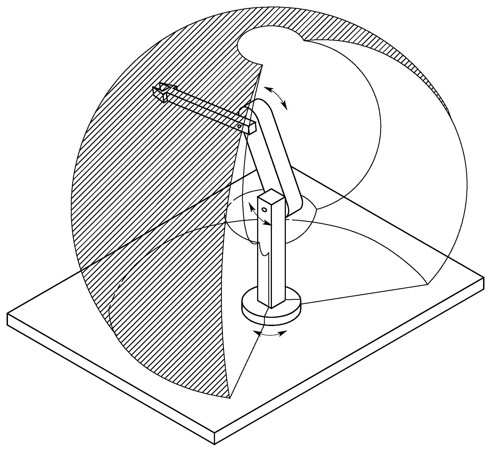
> Anthropomorphic manipulator and its workspace

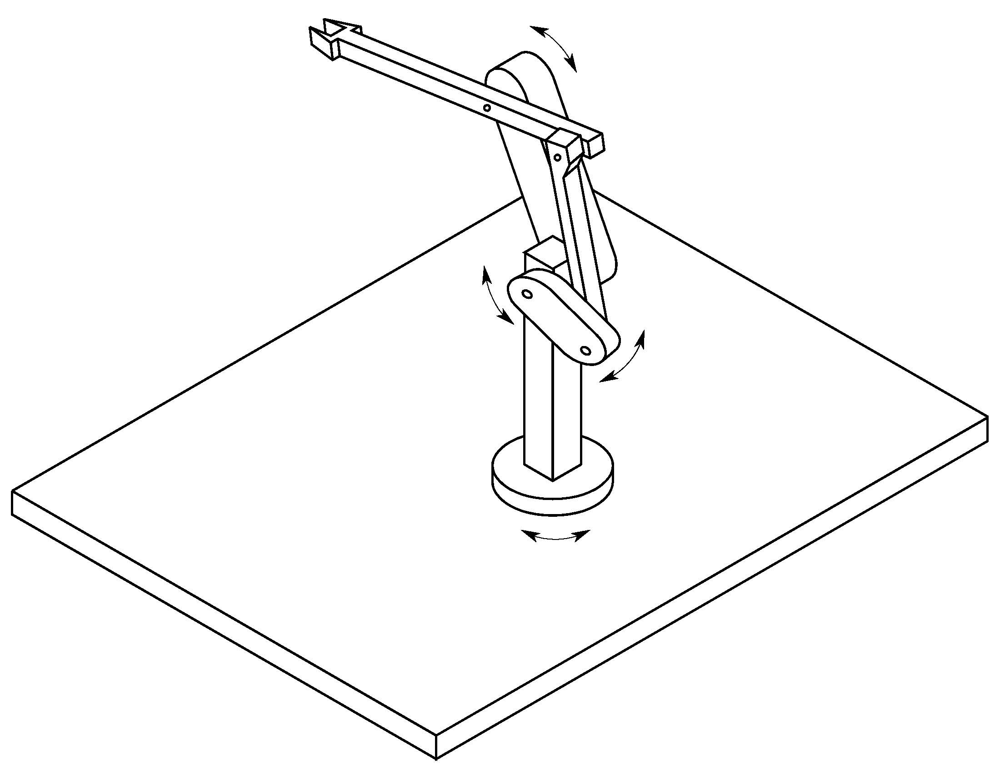
>Manipulator with parallelogram

### Parallel Manipulator

- Multiple kinematic chains connecting base to end-effector
- High structural stiffness
- High operational speeds
- Reduced workspace

_Hybrid_ structure employed for execution of manipulation tasks requiring large values of force along vertical direction

- Parallel arm
- Serial kinematic chain

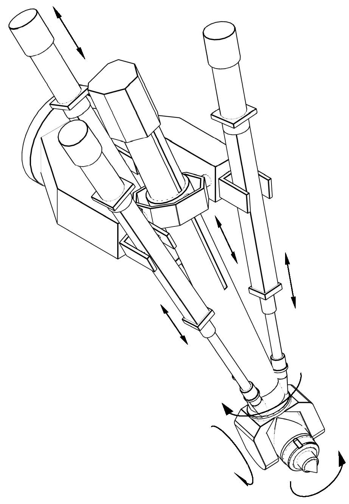
>Hybrid parallel-serial manipulator

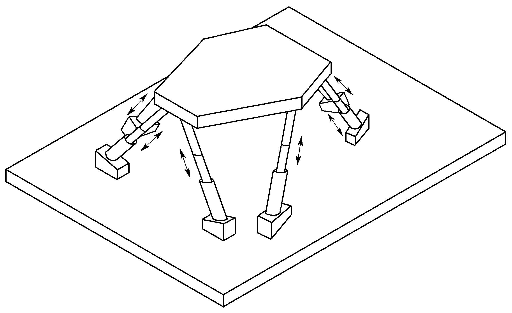
>Parallel manipulator

### Wrist and End-effector

**Spherical Wrist**

- Three revolute joints determining end-effector orientation
    
- High compactness and dexterity
    
- Position and orientation decoupling
    

**End-effector**

- Specified according to task the robot should execute
    
- For material handling tasks gripper of proper shape and dimensions determined by object to be grasped
    
- For machining and assembly tasks tool or specialized device (welding torch, spray gun, mill, drill, screwdriver, etc.)

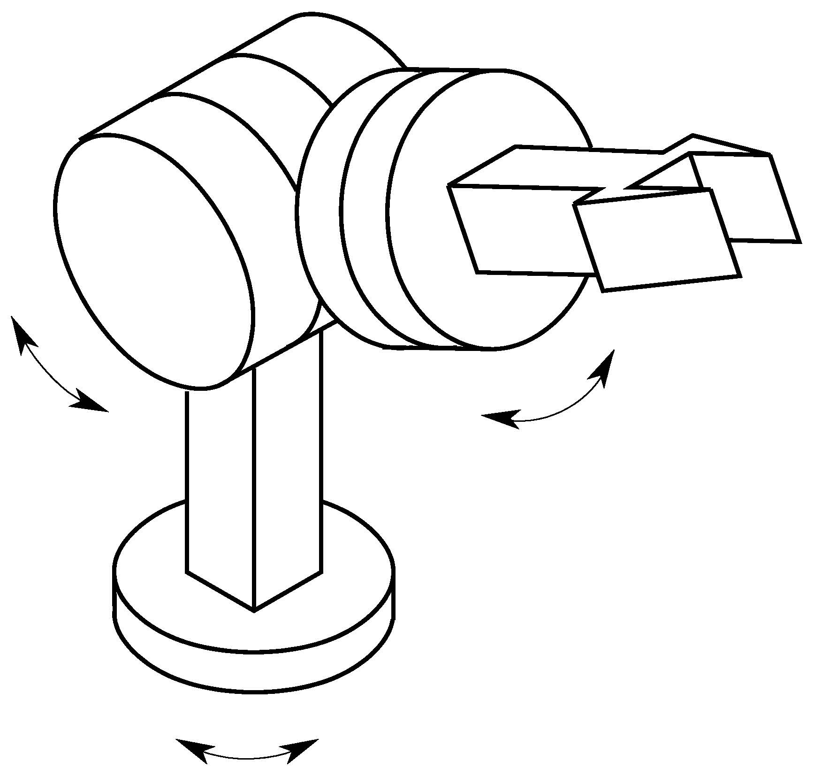
>Spherical wrist