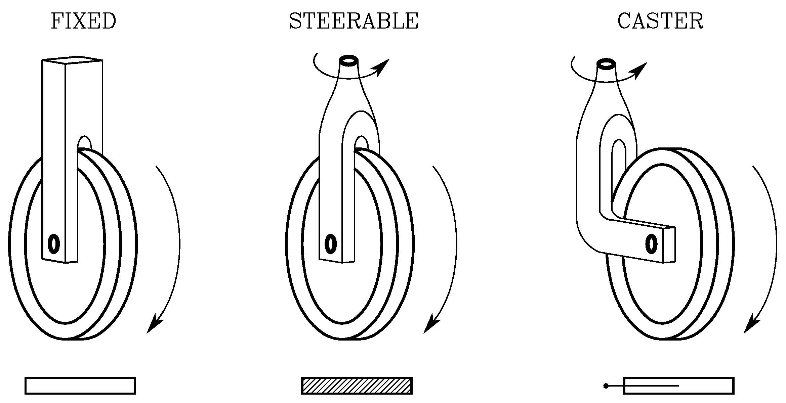
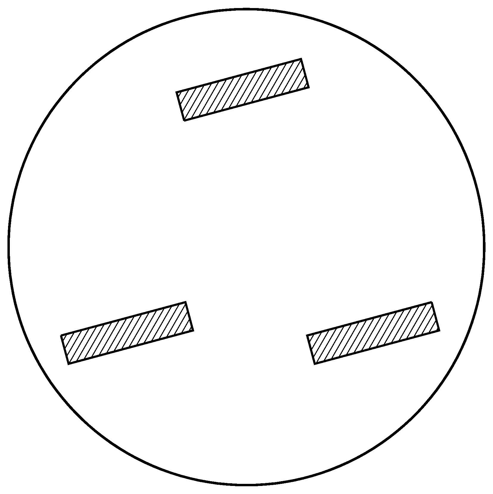

### Wheeled Mobile Robots

The mechanical structure of a mobile robot consists of one or more rigid bodies equipped with a _locomotion_ system

**Wheeled mobile robots**

- _Base_ (chassis)
- _Wheel_s (providing motion with respect to ground)
- Eventually trailers, also equipped with wheels, connected to base by means of revolute joints

**Legged mobile robots**

- Multiple _limbs_
- _Feet_ periodically in contact with ground to realize locomotion
- Design often inspired by living organisms (_biomimetic robotics_)

### Conventional Wheels

**Fixed Wheel**

- Can rotate about an axis going through center of wheel and orthogonal to wheel plane
- Constant orientation with respect to chassis (rigidly attached)

**Steerable Wheel**

- First rotation axis same as fixed wheel
- Second rotation axis going through center of wheel
- Variable orientation with respect to chassis

**Caster Wheel**

- Vertical axis not going through center of wheel (displaced by constant offset)
- Automatic swivel rapidly aligning with direction of motion of chassis
- Supporting point for static balance without affecting mobility of chassis (commonly used in shopping carts and wheelchairs)

>The 3 types of conventional wheels with their respective icons

### Differential-drive Mobile Robot

- Two fixed wheels with common axis of rotation, separately controlled
- One or more passive caster wheels, whose function is to keep robot statically balanced
- Can rotate on the spot, without moving midpoint between wheels, provided that angular velocities of the two wheels are equal and opposite

 
 >A differential-drive mobile robot
 
### Synchro-drive Mobile Robot

- Three aligned steerable wheels synchronously driven by only two motors through mechanical coupling (chain or transmission belt)
- First motor controls rotation of wheels about horizontal axis (vehicle traction)
- Second motor controls rotation of wheels about vertical axis (vehicle steering)
- Often, third motor used to rotate independently upper part of chassis (turret) with respect to lower part (orienting directional sensor or recovering orientation error)

>A synchro-drive mobile robot

### Tricycle Mobile Robot

- Two fixed wheels mounted on rear axle, driven by single motor controlling their traction)
- Steerable front wheel, driven by another motor
- Alternatively, two passive rear wheels and front wheel providing traction and steering

>A tricycle mobile robot

### Car-like Mobile Robot

- Two fixed wheels mounted on rear axle
- Two steerable wheels mounted on front axle
- One motor provides (front or rear) traction
- Another motor changes orientation of front wheels with respect to chassis
- Two front wheels must have different orientation (avoiding slippage)
- Internal wheel slightly more steered with respect to external one (Ackermann steering device)

>A car-like mobile robot

### Omnidirectional Mobile Robot

- Three caster wheels usually arranged in symmetric pattern
- Their traction velocities are independently driven
- Can move instantaneously in any Cartesian direction as well as re-orient itself on the spot

>An omnidirectional mobile robot with three independently driven caster wheels

### Mecanum Wheel

- Fixed wheel with passive rollers placed along external rim
- Axis of rotation of each roller typically inclined by 45° with respect to plane of wheel
- Vehicle equipped with four mecanum wheels mounted in pairs on two parallel axles is also omnidirectional

>A Mecanum (or Swedish) wheel

### Mobile Robots Features

**Balance**

- A three-wheel robot is statically balanced as long as its center of mass falls inside the _support triangle_ defined by the contact points between wheels and ground
- Robots with more than three wheels have a support polygon (typically easier to guarantee balance)
- When robot moves on uneven terrain, a suspension system is needed to maintain contact between each wheel and ground

**Workspace**

- Workspace of mobile robot potentially unlimited
- Local mobility of non-omnidirectional mobile robot always reduced
- A tricycle robot cannot move instantaneously in a direction parallel to rear wheel axle, yet can be manoeuvered so as to obtain net displacement in that direction at end of motion
- Number of robot’s DOFs (number of admissible instantaneous motions) lower than number of its configuration variables

### Mobile Manipulator

- Manipulator mounted on mobile base, combining dexterity of articulated arm with unlimited mobility of base
- Complex design related to robot’s static and dynamic mechanical balance, as well as to actuation of the two systems

>A mobile manipulator obtained by mounting an anthropomorphic arm on a differential-drive vehicle